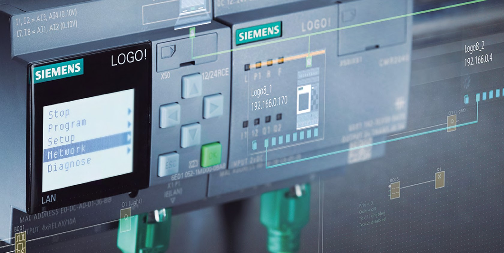

# Conveyor belts automation with the IEC61131-3 standard

The task is to design the control system of a three sections conveyor belt. 
The conveyor belts will be moved by three electric motors M1, M2 and M3, each of them embedding a thermostat that can be used to detect overheating.
The presence of objects is detected by photocells S1, S2 and S3, and inductive sensor S4. 
The HMI consists of 3 pushbuttons (start, stop and reset), one emergency button and two lamps (L1 and L2), for signalling operations. 
All the motors are started when a certain sensor detects an object (for M1 this sensor is S4, for M2 and M3 they are S1 and S2). Each belt must stop if there are no packets on it. 
The stop button lets the machine to complete the delivery operation of packets already on the belt. 
When the machine is in operation, the L2 light must be constantly turned on; in case of problems with any of the motors, all belts are stopped and the alarm light L1 blinks, while when the emergency button is pressed, all the motors are stopped and L1 is turned on constantly. The reset button is supposed to reset alarms and machine internal state.

### Technologies used: IEC 61131-3 (Ladder Diagram, Structured Text), CodeSys, PLC

!Alt text](./Report/Images/Conveyor-belts.png)
